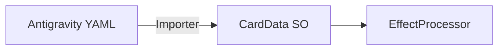

# 유니티 아키텍처 (Unity Architecture)

## 1. 개요
React 기반의 기존 시스템을 유니티(C#) 환경으로 이식하며, **데이터 주도형 아키텍처(Data-Driven Architecture)**를 핵심으로 합니다.

## 2. 프로젝트 폴더 구조
- `Assets/Scripts/Calchemy/Core`: 공용 열거형, 상수, 데이터 스키마.
- `Assets/Scripts/Calchemy/Data`: `ScriptableObject` 기반 카드 데이터.
- `Assets/Scripts/Calchemy/Entities`: 유닛/엔티티 상태 관리.
- `Assets/Scripts/Calchemy/Systems`: 그리드, 전투, 효과 처리기 등 로직 시스템.
- `Assets/Scripts/Calchemy/Events`: 전역 이벤트 허브 (UI/VFX 연동).

## 3. 핵심 시스템
- **GridManager**: 4x4 그리드 로직 및 빙고 판정.
- **BattleManager**: 코루틴 기반의 비동기 전투 턴 흐름 제어.
- **EffectProcessor**: YAML 커맨드를 C# 로직으로 변환하는 처리기.

## 4. 데이터 파이프라인
Antigravity에서 생성된 YAML 데이터를 유니티의 `ScriptableObject`로 변환하여 런타임에서 활용합니다.

