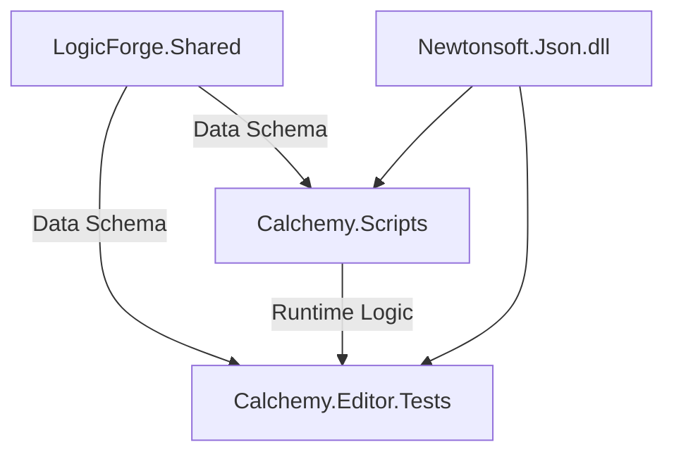

# Logic Structure 2.0 통합 및 어셈블리 리팩토링 로그

## 📅 날짜: 2026-02-01
## 🎯 목표: Logic Structure 2.0 데이터 검증 및 유닛 테스트 환경 구축

이 문서는 Logic Structure 2.0 도입 과정에서 발생한 유니티 컴파일 오류, 어셈블리 종속성 문제, 그리고 이를 해결하기 위한 리팩토링 과정을 기록합니다.

---

## 1. 주요 발생 오류 및 원인 분석

### 🛑 1. SharedLogic 및 UnitEntity 미발견 (CS0246)
*   **증상:** `DataLoader.cs`와 `LogicIntegrityTest.cs`에서 `SharedLogic`, `UnitEntity` 타입을 찾을 수 없다는 오류 발생.
*   **원인:**
    *   **어셈블리 분리 문제:** `Assets/Shared` 폴더(스키마 정의)가 유니티 기본 어셈블리(`Assembly-CSharp`)에 포함되어 있는 반면, `Assets/Scripts`는 `Calchemy.Scripts.asmdef`로 분리됨.
    *   **규칙:** 커스텀 어셈블리(`Calchemy.Scripts`)는 기본 어셈블리를 참조할 수 없음 (단방향 의존성).
*   **해결:**
    *   `Assets/Shared` 폴더에 `LogicForge.Shared.asmdef` 생성하여 독립 어셈블리화.
    *   `Calchemy.Scripts`가 `LogicForge.Shared`를 참조하도록 설정.

### 🛑 2. Extension Method 및 Partial Class 충돌 (CS1061, CS0436)
*   **증상:** `Component` 클래스에 `Name`, `Effect` 속성이 없다는 오류 및 타입 충돌 경고.
*   **원인:**
    *   **Partial Class 제약:** `Component`의 기능을 확장하기 위해 `ComponentExtensions.cs`에서 `partial class`를 사용했으나, 서로 다른 어셈블리(`Shared` vs `Scripts`)에 나뉘어 있어 병합되지 않음.
    *   대신, 동일한 이름의 클래스가 두 개 생성되어(Type Shadowing) 컴파일러가 혼란을 일으킴.
*   **해결:**
    *   `ComponentExtensions.cs` 삭제 (중복 클래스 제거).
    *   `Name` 속성은 원본 `SharedSchema.cs`에 직접 추가.
    *   동작 로직(`Execute`)은 `static class`의 **확장 메서드(Extension Method)** 패턴으로 변경하여 어셈블리 제약 회피.

### 🛑 3. Newtonsoft.Json 참조 오류
*   **증상:** 테스트 코드에서 `Newtonsoft` 네임스페이스를 찾을 수 없음.
*   **원인:**
    *   `Calchemy.Editor.Tests.asmdef`에서 **"Override References"** 옵션을 켰으나, `Newtonsoft.Json.dll`을 `Precompiled References` 목록에 추가하지 않음.
*   **해결:**
    *   `asmdef` 설정의 `Precompiled References` 리스트에 `Newtonsoft.Json.dll` 명시적 추가.

### 🛑 4. UnityEngine.Component 모호성 (CS1929)
*   **증상:** `Execute` 확장 메서드 호출 시 타입 불일치 오류.
*   **원인:**
    *   `using UnityEngine;`으로 인해 코드 내의 `Component`가 `LogicForge.Schema.Component`가 아닌 `UnityEngine.Component`로 인식됨.
*   **해결:**
    *   확장 메서드 서명에 `LogicForge.Schema.Component`와 같이 **전체 네임스페이스 경로(Fully Qualified Name)** 명시.

---

## 2. 변경된 아키텍처 구조

리팩토링 후 프로젝트의 어셈블리 의존성 구조는 아래와 같이 정리되었습니다.

### 📂 폴더별 역할 및 어셈블리
| 폴더 경로 | 어셈블리 파일 (.asmdef) | 역할 |
| :--- | :--- | :--- |
| `Assets/Shared` | `LogicForge.Shared` | 데이터 스키마(DTO) 정의. 의존성 없음. |
| `Assets/Scripts` | `Calchemy.Scripts` | 게임 핵심 로직, 시스템. `Shared` 참조. |
| `Assets/Editor/Tests` | `Calchemy.Editor.Tests` | 유닛 테스트. `Scripts`, `Shared` 참조. |

---

## 3. 결론
이번 리팩토링을 통해 **데이터 정의(Schema)**, **게임 로직(Runtime)**, **테스트(Test)** 간의 명확한 의존성 분리가 완료되었습니다. 이를 통해 향후 코드 유지보수성이 향상되었으며, Unity Test Runner를 통한 자동화 테스트가 가능해졌습니다.
